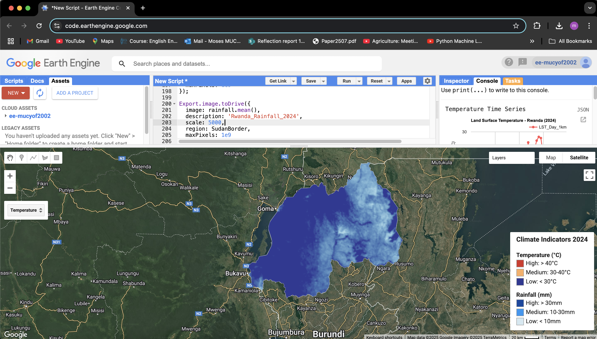

# Rwanda-Climate-Analysis-Tool-2024-

# Overview 
This Google Earth Engine (GEE) script provides a comprehensive analysis of Rwanda's climate patterns, focusing on Land Surface Temperature (LST) and rainfall distribution. The tool offers interactive visualization, temporal analysis, and data export capabilities.

# Features

* Temperature Analysis: MODIS-based LST data processing and visualization
* Rainfall Patterns: CHIRPS precipitation data analysis
* Interactive Maps: Toggle between temperature and rainfall layers
* Time Series Charts: Visual representation of temporal climate patterns
* Point Analysis: Click-based location-specific climate information
* Custom Legend: Clear visualization of data ranges
* Data Export: Direct export to Google Drive in GeoTIFF format

# Data Sources

* Land Surface Temperature: MODIS/061/MOD11A2
* Rainfall Data: UCSB-CHG/CHIRPS/PENTAD
* Administrative Boundaries: USDOS/LSIB_SIMPLE/2017

# Requirements

* Google Earth Engine account
* Access to Google Drive (for exports)

# Installation

1. Open Google Earth Engine Code Editor
2. Create a new script
3. Copy and paste the code from Rwanda_climate_analysis.js
4. Save the script to your GEE account

# Usage
## Basic Operation

1. Load the script in GEE Code Editor
2. Click 'Run' to execute the analysis
3. Use the layer selector to switch between temperature and rainfall views
4. Click on any location to get specific climate values

# Visualization Options

* Temperature Range: 25°C to 45°C
* Rainfall Range: 0mm to 50mm
* Custom color palettes for both parameters

# Data Export
## The tool allows export of:

1. Mean temperature maps
2. Rainfall distribution maps
3. Both in GeoTIFF format to Google Drive

# Methodology Diagram

# Results Analysis 

1. Temperature Analysis Results

2. Rainfall Analysis Results

# License
This project is licensed under the MIT License - see the LICENSE file for details.
